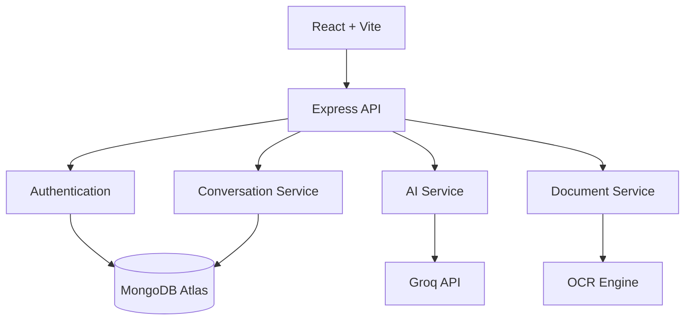

# Novara AI

<p align="center">
  
</p>

<h1 align="center">Novara AI</h1>

<p align="center">
A modern AI workspace for intelligent conversations, document understanding, and productivity.
</p>

<p align="center">


</p>

---

## Overview

Novara AI is a production-oriented full-stack AI application designed to provide a seamless conversational experience while integrating document intelligence, speech capabilities, and user personalization into a single workspace.

The project follows modern software engineering practices with a modular architecture, reusable components, secure authentication, RESTful APIs, and a responsive user interface suitable for real-world deployment.

---

## Why Novara AI?

Novara AI was built with a focus on maintainability, scalability, and developer experience.

- Modular full-stack architecture
- Clean separation between frontend and backend
- Secure authentication and protected APIs
- AI-powered conversations with streaming support
- Document analysis with OCR capabilities
- Responsive interface across devices
- Production-ready deployment workflow

---

## Features

### AI Workspace

| Feature | Description |
|----------|-------------|
| AI Chat | Natural language conversations |
| Streaming Responses | Live AI output |
| Markdown Rendering | Rich formatted responses |
| Code Highlighting | Syntax highlighting |
| Mermaid Support | Diagram rendering |
| LaTeX Support | Mathematical expressions |
| Multiple AI Models | Switch between supported models |
| Conversation Branching | Explore alternate responses |
| Response Regeneration | Retry AI responses |

### Conversation Management

- Unlimited conversations
- AI-generated titles
- Rename conversations
- Archive and pin chats
- Global search
- Export conversations
- Share conversations

### Authentication

- Guest Mode
- Email & Password
- Google Sign-In
- JWT Authentication
- Guest conversation migration

### Document Intelligence

Supported formats:

- PDF
- DOCX
- TXT
- Markdown
- CSV
- JSON
- Images

Capabilities:

- OCR
- Document summarization
- Information extraction
- Image understanding

### Speech

- Speech-to-Text
- Text-to-Speech
- Voice recording

### Personalization

- Theme selection
- AI model selection
- Profile management
- Notification preferences

### Security

- JWT Authentication
- Helmet
- Rate Limiting
- MongoDB Sanitization
- Request Validation
- Secure CORS Configuration

---

## Technology Stack

| Layer | Technologies |
|-------|--------------|
| Frontend | React 19, Vite, React Router, Context API |
| Backend | Node.js, Express 5 |
| Database | MongoDB Atlas, Mongoose |
| Authentication | JWT, Firebase Authentication |
| AI | Groq API, Llama Models |
| Deployment | Vercel, Render |
| DevOps | Docker, GitHub Actions |

---

## Architecture



---

## Project Structure

```text
Novara-AI
│
├── frontend
│   ├── public
│   └── src
│       ├── assets
│       ├── components
│       ├── context
│       ├── hooks
│       ├── pages
│       ├── services
│       ├── styles
│       └── utils
│
├── backend
│   ├── config
│   ├── controllers
│   ├── middleware
│   ├── models
│   ├── routes
│   ├── services
│   ├── utils
│   └── tests
│
├── .github
└── README.md
```

---

## Getting Started

### Clone

```bash
git clone https://github.com/IronVortex/Novara-AI.git
cd Novara-AI
```

### Install

Backend

```bash
cd backend
npm install
```

Frontend

```bash
cd frontend
npm install
```

---

## Environment Variables

```env
PORT=5000

MONGO_URI=

JWT_SECRET=

GROQ_API_KEY=

GROQ_MODEL=

CLIENT_URL=http://localhost:5173
```

---

## Run Locally

Backend

```bash
cd backend
npm run dev
```

Frontend

```bash
cd frontend
npm run dev
```

---

## Build

Frontend

```bash
npm run build
```

Backend

```bash
npm test
```

---

## Screenshots

Replace the placeholders below after deployment.

| Landing Page | Chat Workspace |
|--------------|----------------|
| Screenshot | Screenshot |

| Documents | Settings |
|-----------|----------|
| Screenshot | Screenshot |

---

## Roadmap

Completed

- AI Chat
- Authentication
- Guest Mode
- Document Upload
- OCR
- Speech Recognition
- Conversation Search
- Production Security

Planned

- AI Agents
- Workspace Collaboration
- Plugin System
- Mobile Application
- RAG Knowledge Base

---

## Contributing

Contributions are welcome.

1. Fork the repository.
2. Create a feature branch.
3. Commit your changes.
4. Push the branch.
5. Open a Pull Request.

---

## License

This project is licensed under the MIT License.

---

## Author

**Afshan**

GitHub: https://github.com/IronVortex

---

<p align="center">

Built with React, Express, MongoDB and Groq AI.

<strong>Novara AI</strong> — Intelligent conversations with a clean, modern workspace.

</p>
