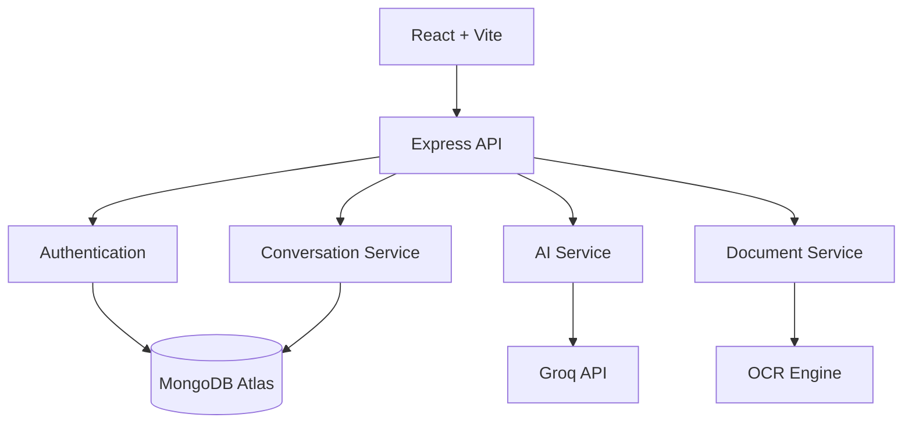

<h1 align="center">Novara AI</h1>

<p align="center">
  A full-stack AI workspace for conversational AI, document intelligence, and productivity.
</p>

<p align="center">
  
  
  
  
  
</p>

<p align="center">
  <a href="#overview">Overview</a> ·
  <a href="#features">Features</a> ·
  <a href="#tech-stack">Tech Stack</a> ·
  <a href="#architecture">Architecture</a> ·
  <a href="#getting-started">Getting Started</a> ·
  <a href="#roadmap">Roadmap</a>
</p>

---

## Overview

Novara AI is a production-oriented full-stack application that combines conversational AI with document intelligence and personalization in a single workspace. It is built with a modular architecture, secure authentication, RESTful APIs, and a responsive UI intended for real-world deployment rather than a proof of concept.

The project emphasizes clean separation of concerns, maintainability, and developer experience, making it straightforward to extend with new AI models, services, or integrations.

## Features

### AI Workspace

| Feature | Description |
|---|---|
| AI Chat | Natural language conversations with streaming responses |
| Markdown & Code Rendering | Rich formatting with syntax highlighting |
| Mermaid & LaTeX Support | Diagrams and mathematical expressions |
| Multiple AI Models | Switch between supported models |
| Conversation Branching | Explore alternate response paths |
| Response Regeneration | Retry and refine AI responses |

### Conversation Management

Unlimited conversations, AI-generated titles, rename/archive/pin, global search, and export/share functionality.

### Authentication

Guest mode, email and password, Google Sign-In, JWT-based sessions, and guest-to-account conversation migration.

### Document Intelligence

Supports PDF, DOCX, TXT, Markdown, CSV, JSON, and image files, with OCR, summarization, information extraction, and image understanding.

### Speech

Speech-to-text, text-to-speech, and in-browser voice recording.

### Personalization

Theme selection, AI model preference, profile management, and notification settings.

### Security

JWT authentication, Helmet, rate limiting, MongoDB query sanitization, request validation, and secure CORS configuration.

## Tech Stack

| Layer | Technologies |
|---|---|
| Frontend | React 19, Vite, React Router, Context API |
| Backend | Node.js, Express 5 |
| Database | MongoDB Atlas, Mongoose |
| Authentication | JWT, Firebase Authentication |
| AI | Groq API, Llama Models |
| Deployment | Vercel, Render |
| DevOps | Docker, GitHub Actions |

## Architecture



## Project Structure

```text
Novara-AI
├── frontend
│   ├── public
│   └── src
│       ├── assets
│       ├── components
│       ├── context
│       ├── hooks
│       ├── pages
│       ├── services
│       ├── styles
│       └── utils
├── backend
│   ├── config
│   ├── controllers
│   ├── middleware
│   ├── models
│   ├── routes
│   ├── services
│   ├── utils
│   └── tests
├── .github
└── README.md
```

## Getting Started

### Prerequisites

- Node.js 22 or later
- A MongoDB Atlas connection string
- A Groq API key

### Clone

```bash
git clone https://github.com/IronVortex/Novara-AI.git
cd Novara-AI
```

### Install

```bash
# Backend
cd backend
npm install

# Frontend
cd ../frontend
npm install
```

### Environment Variables

Create a `.env` file in `/backend`:

```env
PORT=5000
MONGO_URI=
JWT_SECRET=
GROQ_API_KEY=
GROQ_MODEL=
CLIENT_URL=http://localhost:5173
```

### Run Locally

```bash
# Backend
cd backend
npm run dev

# Frontend
cd frontend
npm run dev
```

### Build & Test

```bash
# Frontend build
cd frontend
npm run build

# Backend tests
cd backend
npm test
```
## Roadmap

**Completed**
- AI chat with streaming
- Authentication and guest mode
- Document upload and OCR
- Speech recognition
- Conversation search
- Production-grade security hardening

**Planned**
- AI agents
- Workspace collaboration
- Plugin system
- Mobile application
- RAG-based knowledge base

## Contributing

1. Fork the repository
2. Create a feature branch (`git checkout -b feature/your-feature`)
3. Commit your changes
4. Push the branch
5. Open a pull request

## License

Distributed under the MIT License. See `LICENSE` for details.

## Author

**Afshan**
GitHub: [@IronVortex](https://github.com/IronVortex)

---

<p align="center"><sub>Built with React, Express, MongoDB, and Groq AI.</sub></p>